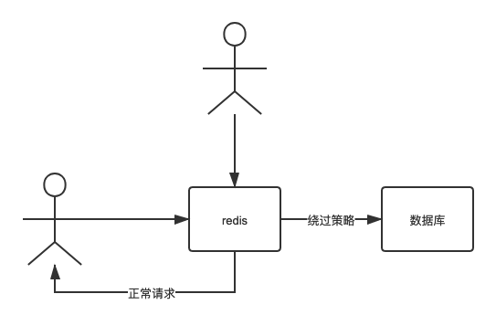

# 缓存穿透

> 恶意请求绕过了缓存的策略，直接请求数据库，此时数据库有可能被打死。



# 演示代码

```java
package com.redis.advanced.pierce;

import com.redis.advanced.service.RedisService;
import lombok.extern.slf4j.Slf4j;
import org.springframework.web.bind.annotation.GetMapping;
import org.springframework.web.bind.annotation.RestController;

import javax.annotation.Resource;

/**
 * 缓存穿透(简单演示):
 * 三方系统
 * <li>用户A</li>
 * <li>缓存B</li>
 * <li>数据库C</li>
 * <li>简单请求流程：A-->B-->C，假如A此时恶意请求B中不存在的数据，那么等于是跳过了B，执行A-->C,此时C存在崩溃的可能</li>
 * @author lizhifu
 * @date 2020/12/9
 */
@RestController
@Slf4j
public class CachePierceController {
    @Resource
    private RedisService redisService;
    @GetMapping("cachePierce")
    public String cachePierce(){
        String cachePierce = redisService.getCacheObject("cachePierce");
        if(cachePierce == null){
            cachePierce = "走数据库查询：数据库可能被打穿";
        }
        return cachePierce;
    }
    @GetMapping("cachePierceSolve")
    public String cachePierceSolve(){
        String cachePierceSolve = redisService.getCacheObject("cachePierceSolve");
        if(cachePierceSolve == null){
            cachePierceSolve = "走数据库查询：数据库可能被打穿";
            //从数据库中只要没查到，就写一个空值到缓存里去
            redisService.setCacheObject("cachePierceSolve","UNKNOWN");
            //并设置超时时间
            redisService.expire("cachePierceSolve",60L);
        }
        return cachePierceSolve;
    }
}
```


# 解决方案

思路：

- 合法参数校验
- IP白名单、黑名单
- 将从数据库查询的数据写入到redis中，然后设置一个过期时间。
- 布隆过滤器